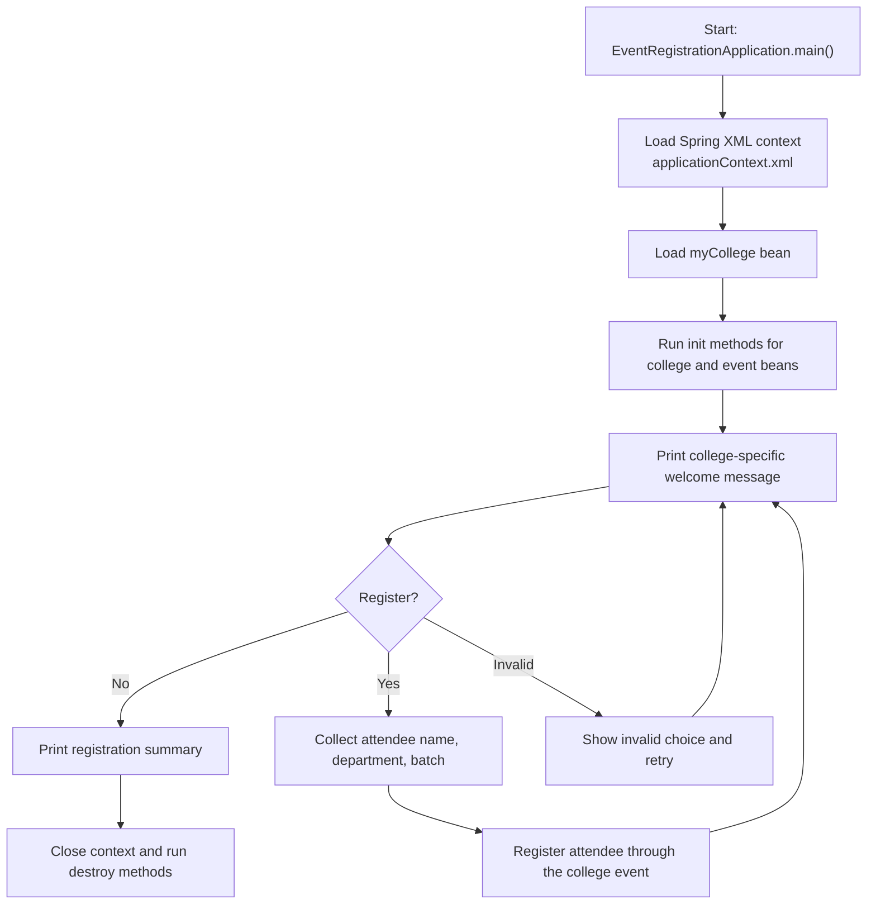

# Event Registration

Event Registration is a Java 17 console application that uses Spring XML bean configuration to register alumni for a graduation ceremony. In `v3`, the project keeps the college-owned event model from `v2` and adds explicit Spring bean lifecycle hooks for the main managed objects.

## GitHub Metadata

- Suggested repository description: `Java 17 Spring console app for graduation ceremony registration with Spring XML lifecycle hooks, college abstraction, and attendee enrollment flow.`
- Suggested topics: `java`, `java-17`, `spring-framework`, `spring`, `maven`, `xml-configuration`, `dependency-injection`, `junit5`, `oop`, `console-application`, `event-registration`, `learning-project`, `portfolio-project`

## Tech Stack

- Java 17
- Maven
- Spring Framework XML configuration
- JUnit 5

## Project Overview

The application models a simple graduation-ceremony registration flow:

- `StudentAttendee` implements the `Attendee` interface.
- `GraduationCeremonyEvent` implements the `CollegeEvent` interface.
- `MyCollege` implements the new `College` interface and owns the event.
- `EventRegistrationWorkflow` manages console interaction and validation.
- `applicationContext.xml` wires the college, event, and prototype attendee beans, including custom init and destroy callbacks in `v3`.

## Current Flow

1. The application starts in `EventRegistrationApplication`.
2. Spring loads `applicationContext.xml`.
3. The app fetches the configured college and prints a welcome message using the college name.
4. The app prints the graduation-ceremony event details from the college's event.
5. The user decides whether to register.
6. If yes, the app collects attendee name, department, and pass-out year.
7. The attendee is registered with the event.
8. Spring lifecycle methods print bean creation and shutdown messages for the managed beans.
9. The app prints a confirmation message and, at the end, a summary list of attendees.

## Flow Diagram



## How To Run

```bash
mvn test
mvn package
java -jar target/event-registration-0.0.1-SNAPSHOT.jar
```

If you prefer the Maven Wrapper, use `mvnw.cmd` on Windows or `./mvnw` on Unix-like systems.

## Sample Output

```text
MyCollege bean created!!
Graduation Ceremony bean created!!
Welcome to the Graduation Ceremony Registration Application for IIT Bombay
The Graduation Ceremony details are as follows:
Venue: Auditorium
Time: 10AM
Date: 12 Nov 2023
Do you want to register for the ceremony?
1. Yes
2. No
Please enter your name:
Please enter your department:
In which year did you pass out?
Hi Bipin, your registration for the Graduation Ceremony is successful
No. of attendees registered are: 1
```

## Known Limitations

- The application is console-based and does not expose a REST API.
- Registered attendees are stored only for the current runtime.
- There is no duplicate-checking, persistence, or event capacity management.

## Why This Repo Exists

This repository is intended as a learning and portfolio project that shows:

- interface-based design
- Spring XML bean wiring
- prototype bean usage
- console workflow handling
- automated tests for wiring and registration flow
- progression from a direct event bean in `v1` to a college-owned event model in `v2`
- bean lifecycle callbacks with Spring `init-method` and `destroy-method` in `v3`
